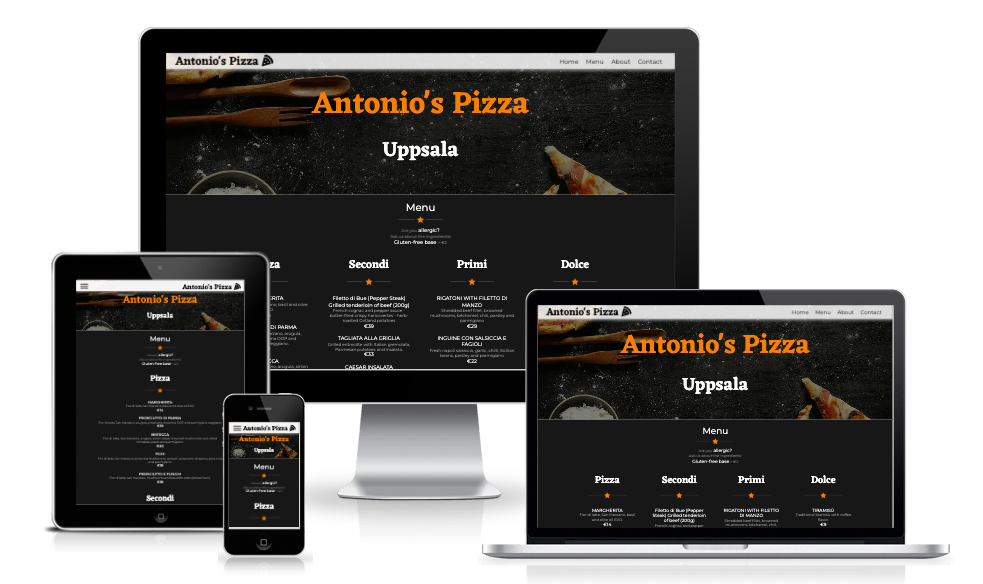
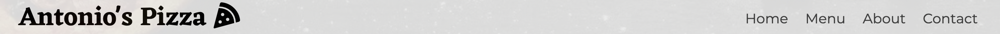
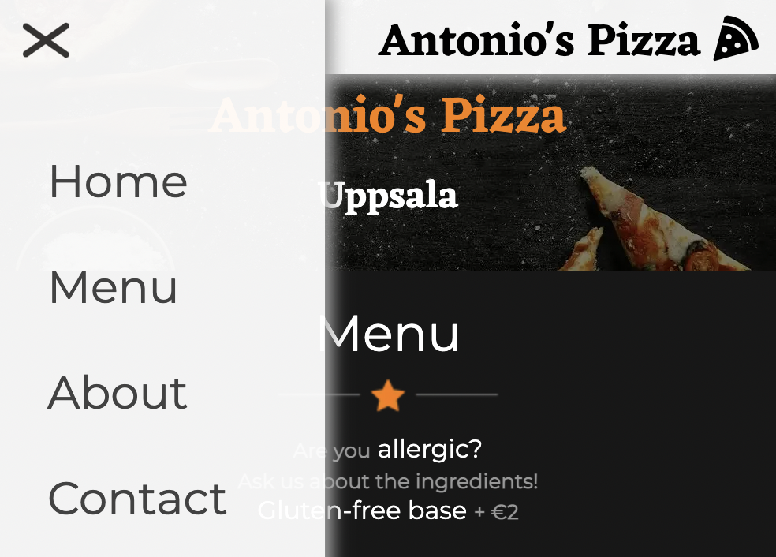
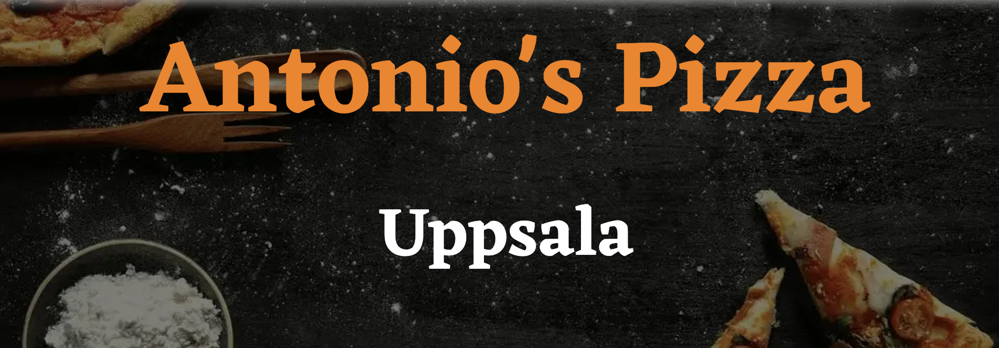
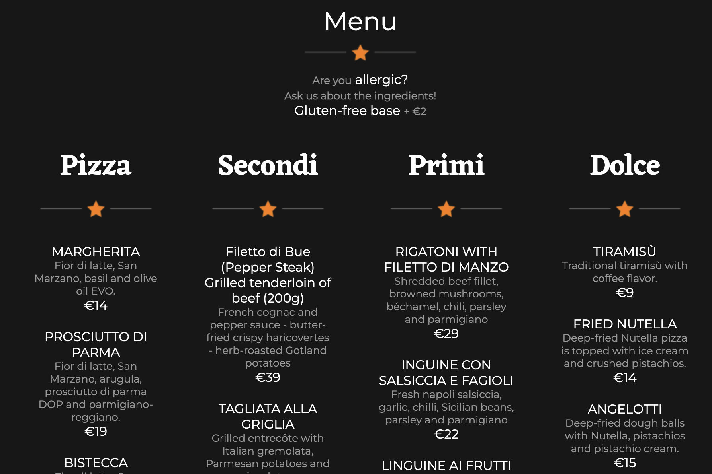
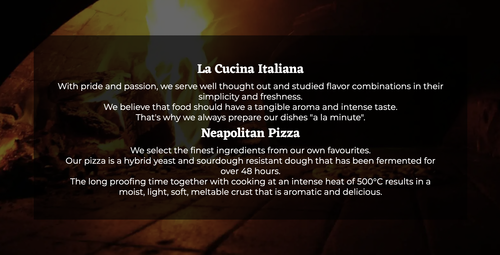
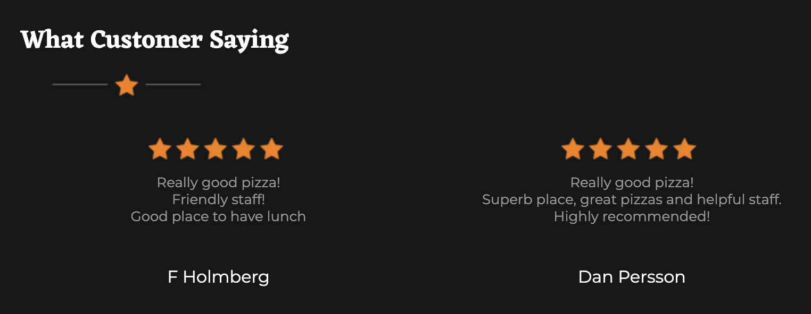
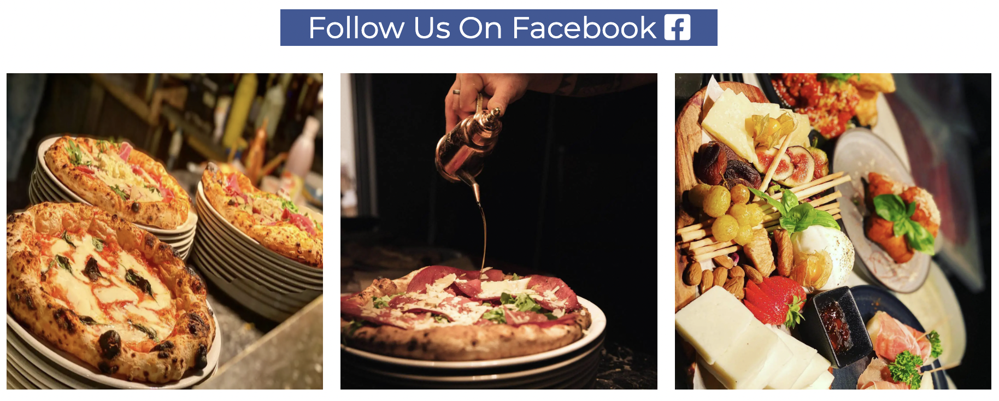
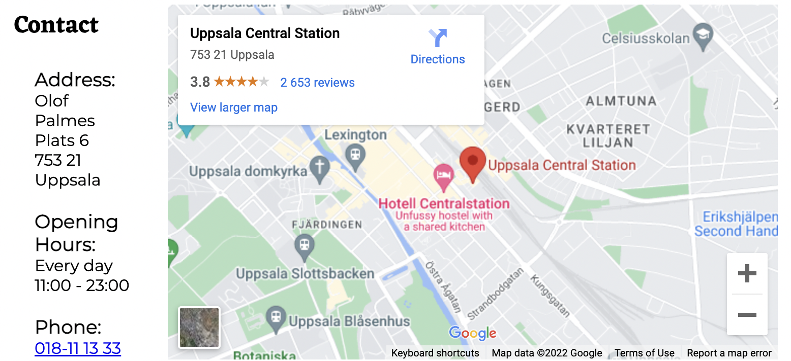
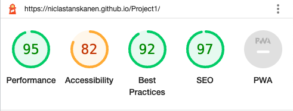

# Antonio's Pizza

Antonio's Pizza is a single scrolling page website that depicts the authentic method of baking pizza in Napoletano's original style. An old 18th-century building in the heart of Uppsala.

Users of this website will quickly and easily find the menu well sorted with ingredients and price. Visitors also get to see a glimpse of what the food looks like. You can also read a little about them. A map and contact details are also available so that visitors can find their way there on their own or call/email if they have any questions.

The live link can be found here - [Antonio's pizza](https://niclastanskanen.github.io/Antonios-Pizza/)

## Features 
----
- __Navigation__
    - At the top of the page, the navigation shows logo in the left corner and home, menu, about, and contact on the right.

    - Navigation is sticky so it's easy for the user to navigate.

    - On devices under 768px width, the navigation will show on the left side with a hamburger menu and the logo will go from the right and slide into the middle of the page on smaller screen devices.

    
---

- __Header__

  - In the heading, the restaurant's name and address are displayed.

  - It provides fast and clear information about the name and location.

---

- __Menu__

  - On the menu, you can see what is available to order, what the ingredients are, and what the price is.

  - A clear division of four categories is presented

---

- __About__

  - This section shows the quality of the food and the cooking process that they use.

  - The background image has a Parallax Scrolling effect on larger screens.

  - On screens with a max width of 768px, the Parallax Scrolling effect is removed.

---

- __What Customer Saying__

  - a section for previous customers and what they think of the restaurant.

---

- __Social Media__ 

  - Social media direct link to Facebook as well as three selected pictures of the food served.
  - Helps the visitor get an insight into the quality and what to expect when visiting the restaurant

---

- __Contact__

  - Easily accessible and clear contact section with address, opening hours, phone number and a map for easy directions

- __Footer__

  - The footer part breaks off with the continuous orange color with quick buttons for mail and call.

---

## Testing 

- I have tested the page in different browsers: Chrome, Safari, Microsoft Edge.

- The entire project is tested with devtools device toolbar and everything works responsively, looks good and arranges itself depending on the size of the screen.

- The call and email buttons work on both telephone and computer.

- Tested so that parallax scrolling is turned off on screens less than 768px width.

### Validator Testing 

- HTML
  - No errors were returned when passing through the official [W3C validator](https://validator.w3.org/nu/?doc=https%3A%2F%2Fniclastanskanen.github.io%2FAntonios-Pizza%2F)

- CSS
  - No errors were found when passing through the official [(Jigsaw) validator](https://jigsaw.w3.org/css-validator/validator?uri=https%3A%2F%2Fniclastanskanen.github.io%2FAntonios-Pizza%2F&profile=css3svg&usermedium=all&warning=1&vextwarning=&lang=en)

  - Lighthouse in devtools 

### Unfixed Bugs

N/A - No unfixed bugs.

---

## Deployment

- The site was deployed to GitHub pages. The steps to deploy are as follows: 
  - In the GitHub repository, navigate to the Settings tab 
  - From the source section drop-down menu, select the Master Branch
  - Once the master branch has been selected, the page will be automatically refreshed with a detailed ribbon display to indicate the successful deployment. 

The live link can be found here - [Antonio's pizza](https://niclastanskanen.github.io/Antonios-Pizza/)

## Credits 

- Hamburger menu - User: Álvaro - url: https://codepen.io/alvarotrigo/pen/XWejzjR

- Parallax Scrolling effect - w3schools - url: https://www.w3schools.com/howto/howto_css_parallax.asp

### Content 

- The text and menu for the page was taken from Paesano italiano [Homepage](https://www.paesanoitaliano.se/meny) and Villa Romana [homepage](https://villaromana.se/index.php/meny)

- The icons in the logo,social media and footer were taken from [Font Awesome](https://fontawesome.com/)

- The icons with a line and a star was created by myself in Canva. [homepage](www.canva.com)

- The code for Google maps was taken from the embedded code for Google maps.

- Mockup picture in README.md from [Am I Responsive?](https://ui.dev/amiresponsive)

### Media

- The header foto from Rawpixel. [homage](https://www.rawpixel.com/)
- The about us foto from Rawpixel. [homage](https://www.rawpixel.com/)
- The images used for the gallery page were taken from Paesano italiano social media. (Permission from the orginal content creator). [Instagram](https://www.instagram.com/paesanouppsala/)

## ACKNOWLEDGEMENTS
- My mentor Mitko from Code Institute
- My stand in mentor Jubril from Code Institute
- Lane-Sawyer Thompson - Community Executive at Code Institute
- Álvaro from codepen with Hamburger menu
- Paesano Italiano for content and picture